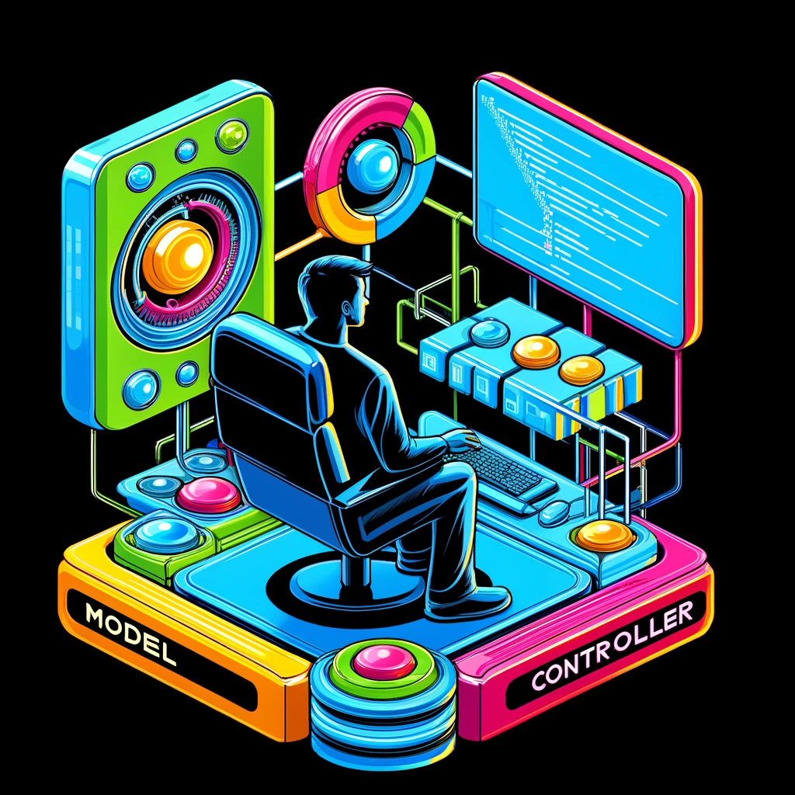

# MVC Coursework Website

This repo contains coursework for the MVC course at BTH University. The coursework is a simple web application built using the MVC pattern. 



## Getting started
The project is built with PHP using Symfony for the backend and Twig for the frontend. Below are the steps to get the project up and running.

### Requirements

Minimum requirements to get started with the project are php 8.3 and composer. 

### Installing requirements
Start by installing PHP and Composer:
- [PHP](https://www.php.net/downloads)
- [Composer](https://getcomposer.org/download/)


Once the basic requirements are in order, clone the repository:

```bash
git clone https://github.com/MartinNalepa/mvc-report
```

Navigate to the project directory:

```bash
cd mvc-report
```

Install the project dependencies:

```bash
composer install
```

This should install all the dependencies. You should now be able to use the Symfony-CLI and you can check requirements by running:
    
```bash
symfony check:requirements
```

## Running the project
Once the requirements are met and the dependencies are installed, you can run the project using the Symfony server

```bash
symfony server:start
```

This will start the server and you should be able to access the project at `http://localhost:8000`. 

To install certificates for HTTPS, run:

```bash
symfony server:ca:install
```

### Tips for modifying the project
The project uses asset-mapper to map assets. If you're unsure how to use it, you can read more about it in the [official documentation](https://symfony.com/doc/current/frontend/asset_mapper.html).

## Deployment

Before deploying the project, make sure to compile the assets:

```bash
php bin/console asset-map:compile
```


## Author

Martin Nalepa


## Acknowledgments
All the friendly teachers at BTH University and my mom :).
